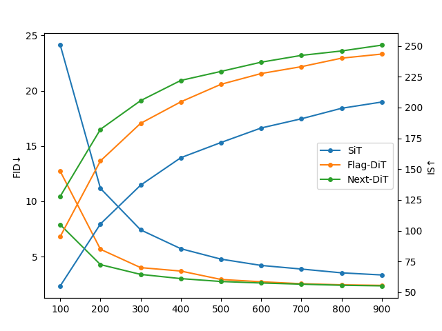

<p align="center">
 
 <br>
</p>

# Next-DiT

The `Next-DiT` is the backbone of `Lumina-Next-T2I`.

## Results

As shown in the figure, `Next-DiT` outperforms `Flag-DiT` and SiT in both FID and IS, indicating that our model performs better.

<p align="left">
 
 <br>
</p>

|  Model   | Params | Training Iters |  FID ↓  |  sFID ↓ |   IS ↑  | Precision | Recall |
|  :---:   | :---:  |     :---:      | :---: | :---:  | :---:  |   :---:   | :---:  |
| Flag-DiT |  600M  |     900K       | 2.40  |  **4.63**  | 243.44 |   0.81    |  0.58  |
| Next-DiT |  600M  |     900K       | **2.36**  |  4.85  | **250.69** |   **0.82**    |  **0.59**  |


## Installation

Before installation, ensure that you have a working ``nvcc``

```bash
# The command should work and show the same version number as in our case. (12.1 in our case).
nvcc --version
```

On some outdated distros (e.g., CentOS 7), you may also want to check that a late enough version of
``gcc`` is available

```bash
# The command should work and show a version of at least 6.0.
# If not, consult distro-specific tutorials to obtain a newer version or build manually.
gcc --version
```

Downloading Lumina-T2X repo from github:

```bash
git clone https://github.com/Alpha-VLLM/Lumina-T2X
```

### 1. Create a conda environment and install PyTorch

Note: You may want to adjust the CUDA version [according to your driver version](https://docs.nvidia.com/deploy/cuda-compatibility/#default-to-minor-version).

  ```bash
  conda create -n Lumina_T2X -y
  conda activate Lumina_T2X
  conda install python=3.11 pytorch==2.1.0 torchvision==0.16.0 torchaudio==2.1.0 pytorch-cuda=12.1 -c pytorch -c nvidia -y
  ```

### 2. Install dependencies

  ```bash
  pip install diffusers fairscale accelerate tensorboard transformers gradio torchdiffeq click
  ```

### 3. Install ``flash-attn``

  ```bash
  pip install flash-attn --no-build-isolation
  ```

### 4. Install [nvidia apex](https://github.com/nvidia/apex) (optional)

>[!Warning]
> While Apex can improve efficiency, it is *not* a must to make Lumina-T2X work.
>
> Note that Lumina-T2X works smoothly with either:
> + Apex not installed at all; OR
> + Apex successfully installed with CUDA and C++ extensions.
>
> However, it will fail when:
> + A Python-only build of Apex is installed.
>
> If the error `No module named 'fused_layer_norm_cuda'` appears, it typically means you are using a Python-only build of Apex. To resolve this, please run `pip uninstall apex`, and Lumina-T2X should then function correctly.

You can clone the repo and install following the official guidelines (note that we expect a full
build, i.e., with CUDA and C++ extensions)

```bash
pip install ninja
git clone https://github.com/NVIDIA/apex
cd apex
# if pip >= 23.1 (ref: https://pip.pypa.io/en/stable/news/#v23-1) which supports multiple `--config-settings` with the same key...
pip install -v --disable-pip-version-check --no-cache-dir --no-build-isolation --config-settings "--build-option=--cpp_ext" --config-settings "--build-option=--cuda_ext" ./
# otherwise
pip install -v --disable-pip-version-check --no-cache-dir --no-build-isolation --global-option="--cpp_ext" --global-option="--cuda_ext" ./
```

## Training

1. Prepared ImageNet dataset

Assuming the ImageNet dataset is in `/path/to/imagenet`. It should be like this:

```
/path/to/imagenet/:
    train/:
        n01440764:
            many_images.JPEG ...
        n01443537:
            many_images.JPEG ...
    val/:
        n01440764:
            ILSVRC2012_val_00000293.JPEG ...
        n01443537:
            ILSVRC2012_val_00000236.JPEG ...
```

Selecting the model with the parameter size you need to run and modify the script files under the `scripts/` directory. (If using slurm cluster, please use the scripts in the `scripts/slurm/` directory.) We provide training scripts for models of 600M, 2B, 3B, and 7B sizes. Please modify `.sh` files under the `scripts/` or `scripts/slurm` according to your requirements.

selecting the model you want to train in `scripts/slurm/run_8gpus.sh`:

```diff
#!/bin/bash

# run Next-DiT with cluster

# added config here for slurm cluster using 8 GPUs

# run Next-DiT 600M
- srun bash exps/600M_bs256_lr5e-4_bf16_qknorm_lognorm.sh
+ # srun bash exps/600M_bs256_lr5e-4_bf16_qknorm_lognorm.sh
# run Next-DiT 2B
- # srun bash exps/2B_bs256_lr5e-4_bf16_qknorm_lognorm.sh
+ srun bash exps/2B_bs256_lr5e-4_bf16_qknorm_lognorm.sh
# run Next-DiT 3B
# srun bash exps/3B_bs256_lr5e-4_bf16_qknorm_lognorm.sh
# run Next-DiT 7B
# srun bash exps/7B_bs256_lr5e-4_bf16_qknorm_lognorm.sh

```

> [!Warning]
> To train models larger than 600MB, please use a cluster with more than 32 GPUs.

You need to modify the `train_data_root` variable in your training script (e.g. `exps/600M_bs256_lr5e-4_bf16_qknorm_lognorm.sh`). Assuming is set `/path/to/your/imagenet/images/train`.

```diff
- train_data_root='/path/to/imagenet/images/train'
+ train_data_root='/path/to/your/imagenet/images/train'
```

2. Run your training

``` bash
# 8 GPUs were used by us for this experiment without slurm cluster
bash scripts/run_8gpus.sh

# 8 GPUs were used by us for this experiment with slurm cluster
srun -n8 --ntasks-per-node=8 --gres=gpu:8 bash scripts/slurm/run_8gpus.sh

# 32 GPUs were used by us for this experiment with slurm cluster
srun -N4 --ntasks-per-node=8 --gres=gpu:8 bash scripts/slurm/run_32gpus.sh
```
