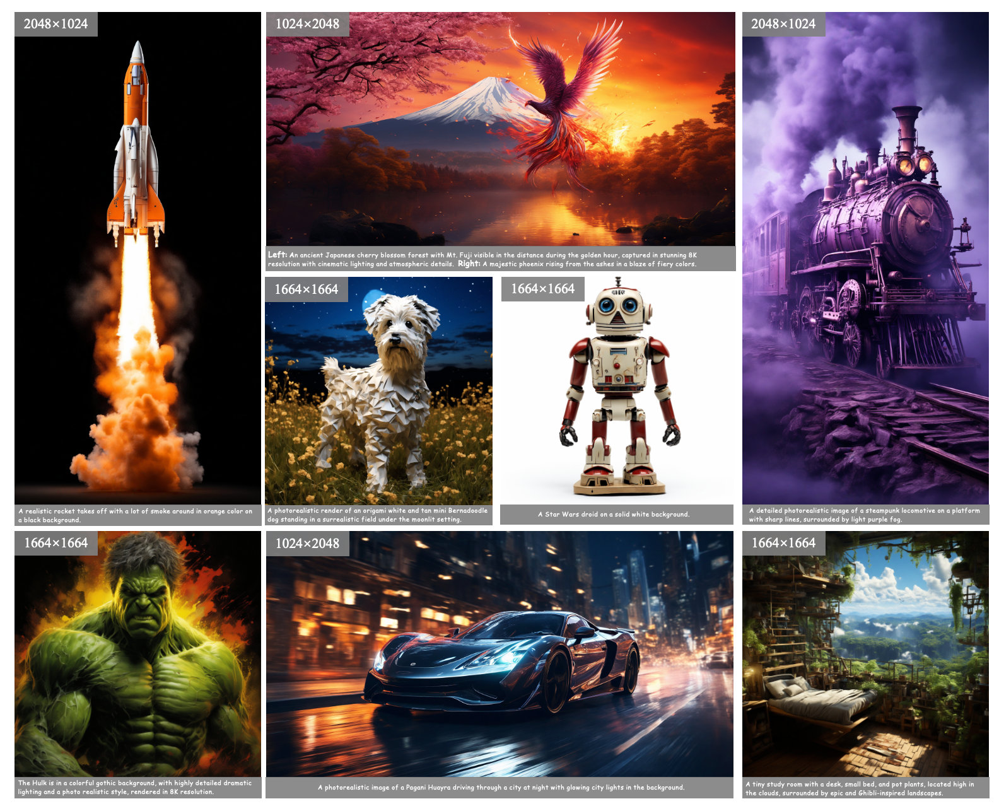
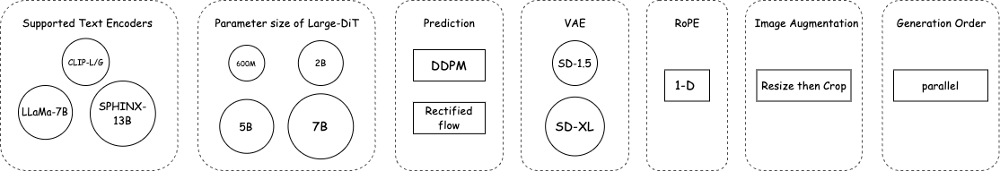

<p align="center">
  
 <br>
</p>

# $\textbf{Lumina-T2X}$: Transform text to any modality with a Flow-based Large Diffusion Transformer

[[中文版本]](./README_cn.md)

## Introduction

We introduce the $\textbf{Lumina-T2X}$ family, a series of text-conditioned Diffusion Transformers (DiT) designed to convert noise into images, videos, multi-view images of 3D objects and generate speech based on textual instructions. At the core of $\textbf{Lumina-T2X}$ lies the Flow-based Large Diffusion Transformer (Flag-DiT), which supports **scaling up to 7 billion parameters** and **extending sequence lengths up to 128,000**. Inspired by Sora, $\textbf{Lumina-T2X}$ integrates images, videos, multi-views of 3D objects, and speech spectrograms within a spatial-temporal latent token space. 

$\textbf{Lumina-T2X}$ allows for the generation of outputs in **any resolution, aspect ratio, and duration**, facilitated by learnable `newline` and `newframe` tokens.

Furthermore, training $\textbf{Lumina-T2X}$ is computationally efficient. The largest model, with 5 billion parameters, **requires only 20% of the training time needed** for Pixart-alpha, which has 600 million parameters.

🌟 **Features**:
- Flow-based Large Diffusion Transformer (Flag-DiT)
- Different Modalities, One Frame
- Any Resolution and Duration Generation
- Low Training Resources


## 📰 News

- [2024-04-19] 🔥🔥🔥 Demo, project introduction and **release**.
- [2024-04-05] 😆😆😆 Code release.
- [2024-04-01] 🚀🚀🚀 We release the initial version of Lumina-T2I for text-to-image generation.

## 📽️ Demos

### Image Generation
<p align="center">
  
 <br>
</p>

### Video Generation

<p align="center">
  
 <br>
</p>

### Multi-view Generation

<p align="center">
  
 <br>
  
</p>

### High-res. Image Editing

<p align="center">
  
 <br>
  
</p>

### Compositional Generation

<p align="center">
  
 <br>
</p>

### Resolution Extrapolation

<p align="center">
  
 <br>
  
</p>

### Consistent-Style Generation

<p align="center">
  
 <br>
</p>

## ⚙️ Diverse Configurations

We support diverse configurations, including text encoders, DiTs of different parameter sizes, inference methods, and VAE encoders. Additionally, we offer features such as 1D-RoPE, image enhancement, and more.

<p align="center">
  
 <br>
</p>

## 🚀 Quick Start

For more about training and inference, please refer to [Lumina-T2I README.md](./Lumina-T2I/README.md#Installation)

<!--

## 📄 Citation

```
@inproceedings{luminat2x,
  author    = {},
  title     = {},
  booktitle = {},
  pages     = {}
  year      = {2024}
}
```

## Star History

 [](https://star-history.com/#Alpha-VLLM/Lumina-T2X&Date) -->
